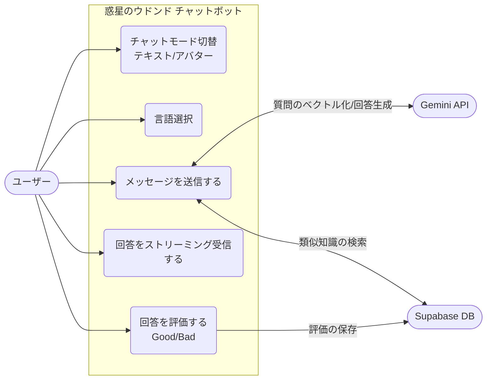
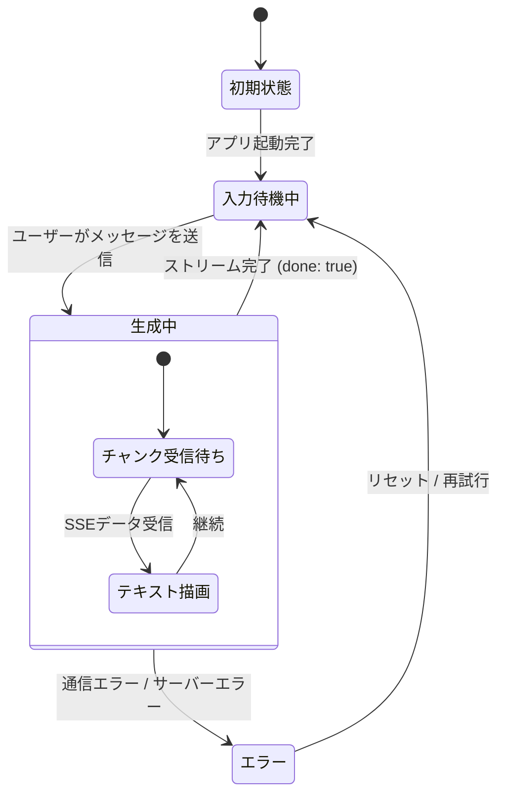
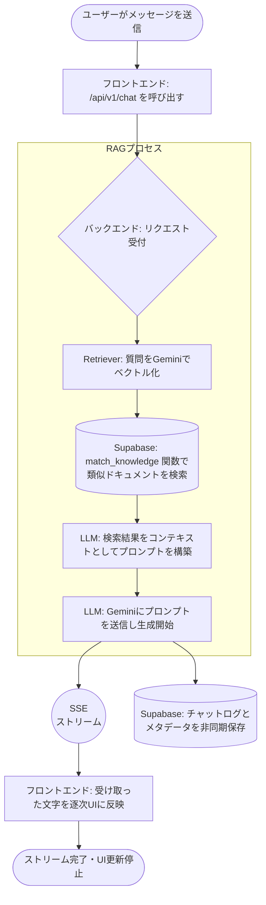
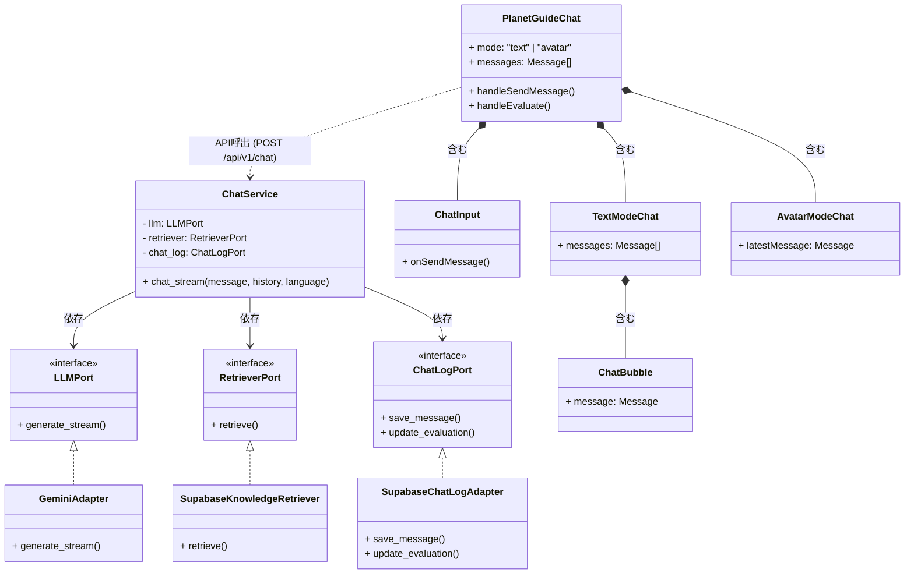

# udondo-chatbot

ご提示いただいたコードとアーキテクチャ（Next.js + FastAPI + Supabase + Gemini のRAG構成）を元に、データの流れやAPI・UIの関連性を可視化するための各種図（Mermaid）と解説を作成しました。

### 1. APIとUI用ファイルの流れ（データフロー）
まず、ユーザーが画面を操作してからAPIを通り、回答が返ってくるまでのファイル間のつながりを解説します。

**【UI側の流れ (Frontend: Next.js)】**
1. `app/page.tsx` が起点となり、メインコンポーネントである `components/planet-guide-chat.tsx` を呼び出します。
2. `PlanetGuideChat` は会話履歴（状態）を保持し、以下のコンポーネントを組み立てます：
   - ヘッダー操作：`chat-header.tsx`
   - 表示切替：`text-mode-chat.tsx` または `avatar-mode-chat.tsx`（中で `chat-bubble.tsx` などを呼び出し）
   - 入力欄：`chat-input.tsx`
3. ユーザーが `ChatInput` から送信すると、`PlanetGuideChat` の `handleSendMessage` 関数が発火し、`/api/v1/chat` にPOSTリクエストを送ります。
4. レスポンスはSSE（Server-Sent Events）でチャンクごとに返ってくるため、ストリームを読み取りながらリアルタイムにUIのメッセージ状態を更新します。

**【API側の流れ (Backend: FastAPI)】**
1. リクエストは `api/index.py`（Vercel Serverless Function）を通り、`src/main.py` の FastAPI アプリケーションに到達します。
2. `src/api/v1/chat.py` のルーティングがリクエストを受け取り、`ChatService` (`src/application/chat_service.py`) を呼び出します。
3. `ChatService` は依存性の注入（DI）を利用して以下の処理をオーケストレーションします：
   - **検索 (Retrieval):** `SupabaseKnowledgeRetriever` (`src/infrastructure/supabase/`) がユーザーの質問をベクトル化し、Supabaseから関連情報を取得します。
   - **生成 (Generation):** `GeminiAdapter` (`src/infrastructure/llm/`) が、検索した知識と質問を元に回答をストリーミング生成します。
   - **保存 (Logging):** 回答完了後、`SupabaseChatLogAdapter` がチャット履歴をデータベースに保存します。

---

以下に、システム全体を把握するための各種Mermaid図を示します。

### 2. ユースケース図
システムが「誰に」「どのような機能」を提供しているかを表します。

### 3. 状態遷移図
チャット画面における、メッセージ送信から受信までの状態の変化を表します。

### 4. アクティビティ図
ユーザーがメッセージを送信した際の、RAG（検索拡張生成）の具体的な処理フローを表します。

### 5. クラス図
バックエンドのクリーンアーキテクチャ（ポートとアダプター）の構造と、フロントエンドの主要コンポーネントの関係性を表します。

現在の実装は、バックエンド側が「ドメイン/インターフェース」と「インフラ（外部API/DB）」を明確に分離しているため、今後別のLLMや別のデータベースに乗り換える際も `Adapter` 部分を書き換えるだけで済む、非常に拡張性の高い設計になっています。追加機能（認証機能やチャット履歴の永続化など）を実装する際も、この構造に沿って機能追加を行っていくことが可能です。