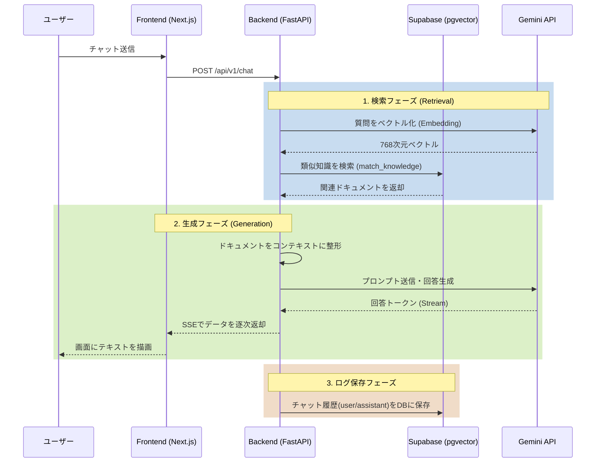

# うどんど Chatbot

FastAPI + LangChain + Gemini + Supabase(pgvector) を使った、RAG（Retrieval-Augmented Generation）型の多言語チャットボットです。  
フロントエンドは Next.js、バックエンドは FastAPI で構成されています。

## 1. システム概要

- 目的
	- ナレッジベース（Supabase DB）を根拠に回答するチャットボットを提供する
- 特徴
	- RAG構成（検索 + 生成）
	- SSE（Server-Sent Events）によるストリーミング応答
	- 日本語/英語対応（フロントのロケール + バックエンドの言語指定）
	- SupabaseのpgvectorとGemini Embeddingを用いた高精度なベクトル類似度検索

## 2. アーキテクチャ

本プロジェクトは以下の 2 層で構成されています。

- frontend（Next.js）
	- ユーザーの入力を受け取り、バックエンドへ送信
	- SSEストリームを受信し、逐次画面に反映
- backend（FastAPI）
	- `/api/v1/chat` でチャット要求を受ける
	- クエリをベクトル化し、Supabase(pgvector)から関連文書を検索
	- Gemini で回答を生成し、SSEで返却
	- 処理完了後にチャットログをバックグラウンドでDBへ保存

### 処理フロー



## 3. 仕様

### 3.1 バックエンド

- フレームワーク: FastAPI
- Python: 3.12 以上
- 主なライブラリ
	- `google-genai`
	- `fastapi` / `uvicorn`
	- `supabase` (supabase-py)
	- `sse-starlette`
- ベクトル検索
	- 埋め込み: `gemini-embedding-001` (Google GenAI)
	- 保存先: Supabase PostgreSQL (`pgvector`拡張の `knowledge_base` テーブル)

### 3.2 フロントエンド

- フレームワーク: Next.js（App Router）
- React: 19 系
- 多言語対応: `next-intl`
- API通信
	- `NEXT_PUBLIC_API_URL` でバックエンドURLを指定
	- `POST /api/v1/chat` を `text/event-stream` で受信

### 3.3 API仕様

#### POST `/api/v1/chat`

- 説明
	- チャット要求を受け取り、SSEで回答を返す
- Request Body（JSON）

```json
{
	"message": "おすすめメニューを教えて",
	"history": [
		{ "role": "user", "content": "こんにちは" },
		{ "role": "assistant", "content": "こんにちは。ご質問をどうぞ。" }
	],
	"language": "ja"
}
```

- SSEイベント（`data:`）

```json
{ "content": "...部分応答...", "done": false }
```

完了時:

```json
{ "content": "", "done": true }
```

エラー時:

```json
{ "error": "...", "done": true }
```

#### GET `/api/v1/health`

- 説明
	- ヘルスチェック
- レスポンス例

```json
{ "status": "ok", "service": "udondo-chatbot-api" }
```

## 4. 要件

### 4.1 必須環境

- macOS / Linux / Windows（WSL含む）
- Python 3.12+
- Node.js 20+
- npm 10+（または yarn/pnpm/bun）
- Google Gemini APIキー

### 4.2 環境変数

バックエンドは `backend/.env.local` を読み込みます。

最小構成:

```env
GEMINI_API_KEY=your_gemini_api_key
NEXT_PUBLIC_SUPABASE_URL=https://your-project.supabase.co
NEXT_PUBLIC_SUPABASE_PUBLISHABLE_DEFAULT_KEY=your-anon-key
```

任意設定（例）:

```env
CORS_ORIGINS=["http://localhost:3000","http://127.0.0.1:3000"]
EMBEDDING_MODEL=gemini-embedding-001
LLM_MODEL=gemini-2.5-flash-lite
RETRIEVAL_TOP_K=5
```

フロントエンド側（`frontend/.env.local`）:

```env
NEXT_PUBLIC_API_URL=http://localhost:8000
```

## 5. ファイル構成

主要ディレクトリのみ抜粋:

```text
udondo-chatbot/
	backend/
		pyproject.toml
		data/
			knowledge_base.json
			chroma_db/
		src/
			main.py
			api/
			application/
			core/
			domain/
			infrastructure/
	frontend/
		package.json
		messages/
			ja.json
			en.json
		src/
			app/
			entities/
			features/
			shared/
			widgets/
```

## 6. セットアップと実行方法

プロジェクトルート（この README がある階層）で作業します。

### 6.1 バックエンド起動

1. 依存関係をインストール

```bash
cd backend
python -m venv .venv
source .venv/bin/activate
pip install -U pip
pip install -e .
```

2. 環境変数ファイルを作成

`backend/.env.local` を作成し、最低限 `GEMINI_API_KEY` を設定してください。

3. サーバー起動

```bash
uvicorn src.main:app --reload --host 0.0.0.0 --port 8000
```

### 6.2 フロントエンド起動

別ターミナルで:

```bash
cd frontend
npm install
npm run dev
```

ブラウザで以下を開きます。

- `http://localhost:3000`

## 7. 動作確認

### 7.1 ヘルスチェック

```bash
curl http://localhost:8000/api/v1/health
```

### 7.2 チャットAPI確認（SSE）

```bash
curl -N -X POST http://localhost:8000/api/v1/chat \
	-H "Content-Type: application/json" \
	-H "Accept: text/event-stream" \
	-d '{
		"message": "うどんのおすすめを教えて",
		"history": [],
		"language": "ja"
	}'
```

## 8. 開発時の注意点

- ナレッジのインジェスト（ベクトル化）は、必要に応じて `backend/scripts/generate_embeddings.py` を手動で実行してください。
- バックエンドを初めて稼働させる前に、Supabase で `pgvector` 拡張と `knowledge_base`, `chat_logs` などのテーブル、RPC関数の配備が必要です。
- CORSで許可していないオリジンからはAPIアクセスできません
- `.env.local` は機密情報を含むため、リポジトリにコミットしないでください

## 9. よくあるトラブル

- `401/403` や Gemini関連エラーが出る
	- `GEMINI_API_KEY` が未設定または無効の可能性
- フロントからAPIに接続できない
	- `NEXT_PUBLIC_API_URL` とバックエンドポートを確認
	- CORS設定を確認
- 回答が空または期待より弱い
	- `backend/data/knowledge_base.json` の内容とインジェスト結果を確認

## 10. 今後の拡張候補

- 認証/認可（JWTやAPIキー）
- 会話履歴の永続化
- ナレッジ更新の差分インジェスト
- テスト自動化（API・E2E）
